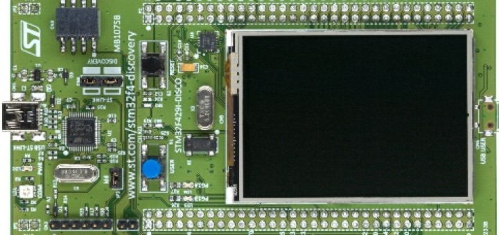

# MNIST_STM32
 
 Along with the deepening development in communication technologies and the surge of mobile devices, Edge Computing, is surging in popularity.  Meanwhile, Artificial Intelligence (AI) applications are thriving with the breakthroughs in deep learning and the upgrade of hardware architectures. Billions of bytes of data, generated at the network edge, put    great demands on data processing and structural optimization. Therefore, there exists a strong demand to integrate Edge Computing and AI, which gives birth to Edge Intelligence.  
This project explores this concept and offers an MNIST Handwritten Digit Recognition model desiged to run on STM32F429I Disco board. The model is a CNN built using Keras anf TF2 and compressed and generated using X-Cube-AI.

Demo: 

  

 ## Hardware 
 
 This project is built using STM32CubeIDE and tested on STM32F429I-DISCO baord , but it can be easly modifed to be used on any STM32F4 board.
 
 
 
 ## The model 
 
 The model used is CNN trained on MNIST dataset for handwriten-digit recognition. Tensorflow  with Keras were used to train and save the model. Then X-CUBE-AI is used to generate THE C code from the trained model. Its architecture is as follows:
 

  

## The Steps 

- The first step was creating and setting up the project in STM32CubeIDE. This icludes selecting the target board (STM32F429I DISCO), configuring the necessary pins, clock speed and peripherals as well as enabling AI. One must also set the paths for the external drivers to be used (BSP and utilities).
It is also important to run an analysis on the CNN neural net to see if it would fit on the target board on not ( check the necessary FLAH and RAM memory needed ) 
- The second step is to implement  the touch sensor and user interface, which consists of writing zone on which the used is propmted to write a digit, a scaled down 28x28 image of what the user wrote (NN input), the NN prediction and a button to reset the UI. 
- The final step is to deploy the Neural Network and dispaly the most two significant probabilities i.e guesses of our CNN ( we want to see how accurate the predictions are in the presence of simularities because for example, handwritten 3 can be mistaken for an 8 and so on .. ). You can use Teraterm or putty to display the first two labels and their probabilities. 

  
  
  

 
